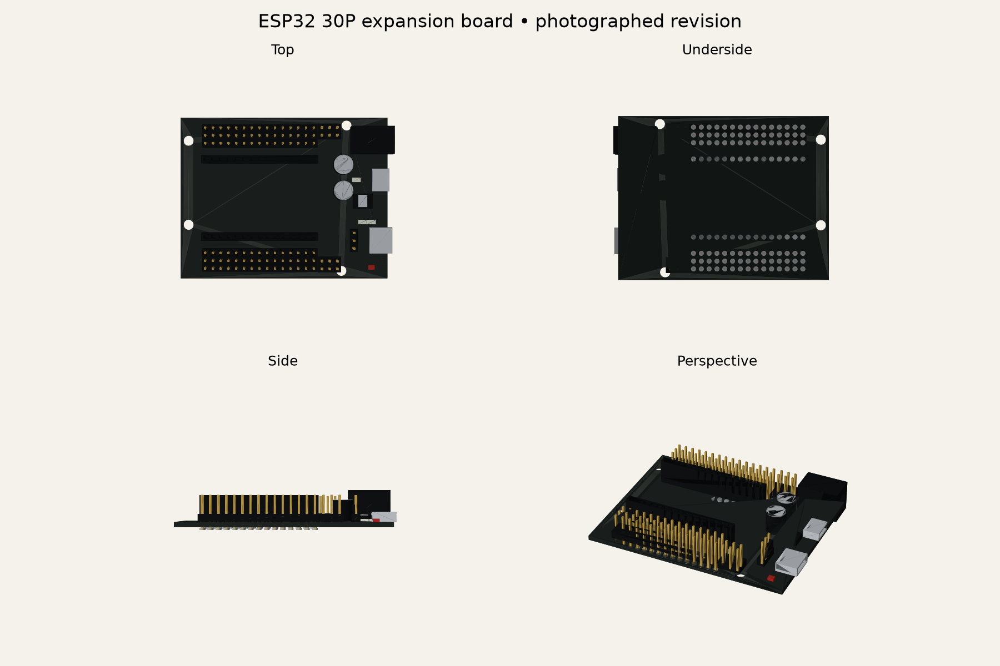
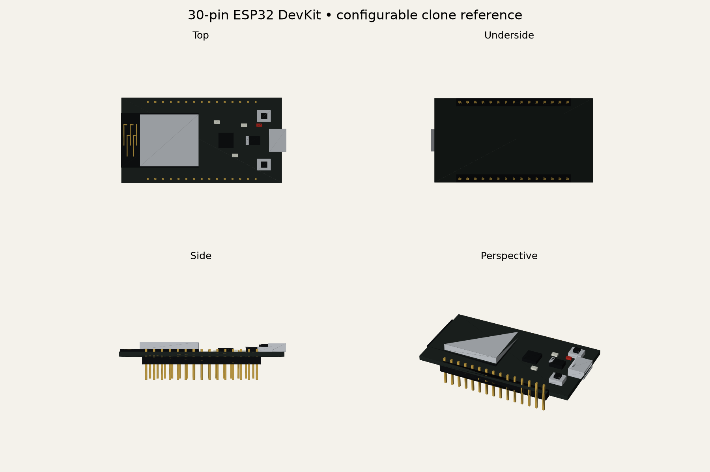
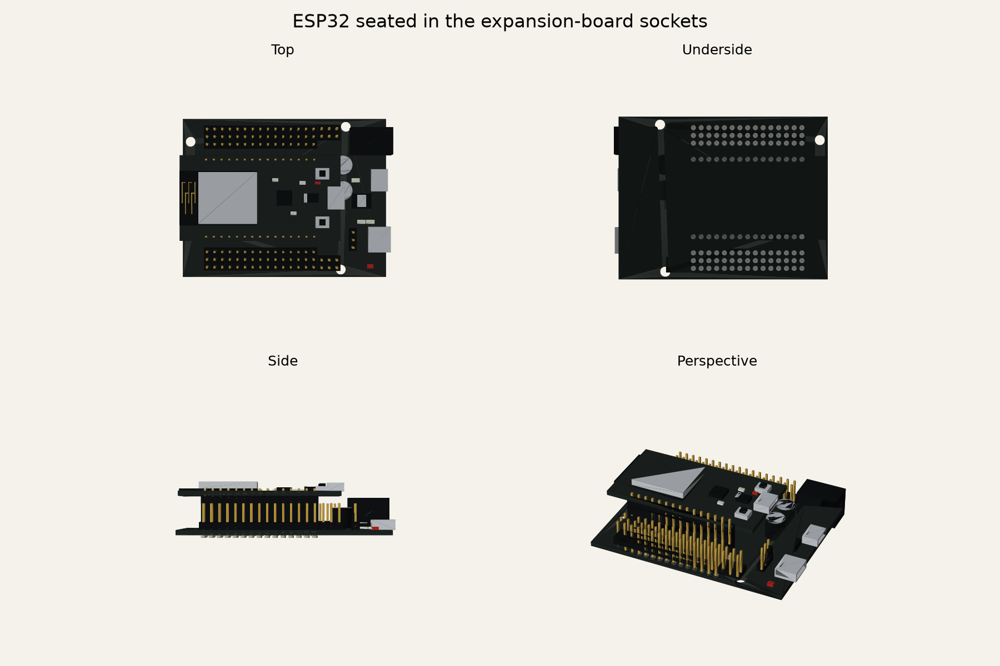
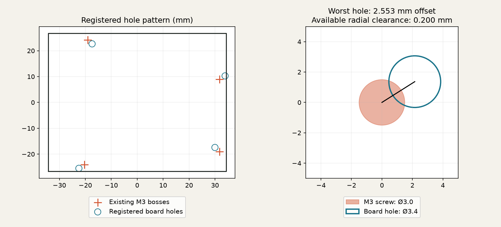

# ESP32 boards on the azimuth

The azimuth carries a purchased ESP32/ESP32S 30P expansion board with a 30-pin ESP32 DevKit seated in its two sockets. Both boards and four M3 × 6 mm socket screws belong to `simulator_base_yaw`; they rotate with the azimuth, independently of the shoulder. They are reference models, not printable electronics or firmware changes.

## Dimensions and sources

Corey's `expansion-dimensions.png` controls the carrier: 68.6 × 53.4 mm, four Ø3.4 mm holes, with projected pair spans 52.52 / 50.81 / 48.39 / 27.96 mm. Those spans are not a rectangular grid. The photograph shows the underside; the top-side model mirrors its X coordinates. Absolute edge offsets are inferred from the image and original mounting datum: top-side hole centers are `(20.77, 24.13)`, `(-31.75, 19.05)`, `(-31.75, -8.91)`, `(19.06, -24.26)` mm about the PCB center.

The [Handson expansion-board PDF](https://handsontec.com/dataspecs/module/ESP/ESP32%20Expansion%2030P.pdf) supports the component arrangement and 2.54 mm headers. Its different 65 × 55 mm / 60 × 50 mm mounting variant is not used. Corey's component photo shows a small micro-B power connector between the barrel jack and USB-C socket; all three appear in the reference.

The development-board PCB defaults to 53 × 28.2 × 1.6 mm. The [Wokwi 30-pin board](https://github.com/wokwi/wokwi-boards/blob/main/boards/esp32-devkit-v1/board.json) provides a visual envelope, not a verified clone mechanical drawing. Supplier research did not establish a dimensioned drawing for Corey's particular clone. Its PCB outline, thickness, header offsets, row spacing, and USB variant remain configurable in `DevkitSpec`. Two 15-pin rows use the requested 25.4 mm spacing and 2.54 mm pitch; verify these against the physical board before printing. A 38-pin DevKitC is not substituted.

The WROOM module envelope is 18 × 25.5 × 3.1 mm, following [Espressif's module datasheet](https://documentation.espressif.com/esp32-wroom-32_datasheet_en.html). Header heights and insertion lengths, connector dimensions, component positions and heights, solder beads, PCB thickness, and antenna trace detail are visual estimates. The shield, antenna, USB port, BOOT/EN buttons, regulator, USB serial IC, signal/VCC/GND rails, I²C and voltage output headers, voltage jumper, capacitors, and power LED are separate purchased component leaves.

## Seated stack and mounting change

Female sockets stand 8.5 mm above the 1.6 mm carrier PCB. The 2.5 mm male spacer seats against them, placing the DevKit PCB underside at **12.6 mm** above the carrier underside. Pins insert 5 mm into 6 mm-deep socket cavities. The carrier solder envelope is 0.9 mm below its PCB; it must remain clear of the printed recess.

The original Uno-derived bosses do not fit the photographed board with its populated face pointing outward. The fit searches all 24 hole assignments and proper rotations, allowing translation but no PCB distortion or reflection. Best registration is −8.063306° in the mount Z/Y datum with translation `(−0.201875, −4.150759)` mm. Residual offsets are 2.227346, 2.553347, 2.398755, and 2.553347 mm; nominal M3 radial allowance in Ø3.4 mm holes is only 0.2 mm.

Corey approved repositioning the four bosses/pilots to the registered photograph pattern. The original `ARDUINO_STANDOFF_POINTS_YZ` remains the historical reference; the installed mount uses `ESP32_STANDOFF_POINTS_YZ`. The PCB hole pattern is unchanged. The recess follows the tilted board footprint, including the power connectors’ 1.7 mm edge overhang and the DevKit PCB’s 0.2 mm antenna-end overhang, with 0.5 mm edge clearance while retaining the 3.2 mm back skin and 12 mm deck. The populated board intersects the elbow motor at the former −130° shoulder stop; simulator motion is now limited to ±125° (about 2.3 mm elbow-motor clearance at −125°). The Uno motion-safety architecture and firmware are unchanged. The installed pair occupies X 27.6–45.8, Y −35.398–27.096, and Z 40.674–116.294 mm in the master assembly. Screw heads seat on the carrier PCB, with 4.4 mm shank engagement below it.

## Reproduce and inspect

Run `uv run python -m pytest`, then export and publish sequentially:

```sh
uv run python scripts/generate_catalog.py
uv run python scripts/generate_progress_feed.py
uv run python scripts/export_models.py
uv run python scripts/publish_web_models.py
cd site
npm run build
npm run test:motion
npm run smoke -- --workers=1
```

Do not overlap the CAD suite with a second master-assembly build/export. `scripts/render_esp32.py` renders exported finish meshes and the fit overlay using optional NumPy/Matplotlib; run it after exports with a Python environment containing those packages. Generated STEP/STL files remain in `models/out/` and are uploaded by CI.





